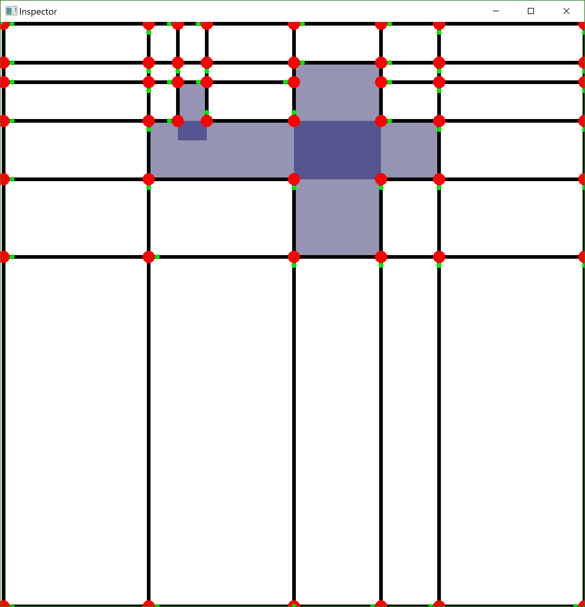

# rusty-shortest-path-map-inspector
Generates a visual representation of the debugger log *.jkmmap files which are generated by the shortest path map tester module. The running program will look something like this:

To open a *.jkmmap file, simply give its path as an argument to the inspector.

The only purpose of this module is to make dubugging the shortest-path-map module easier.
